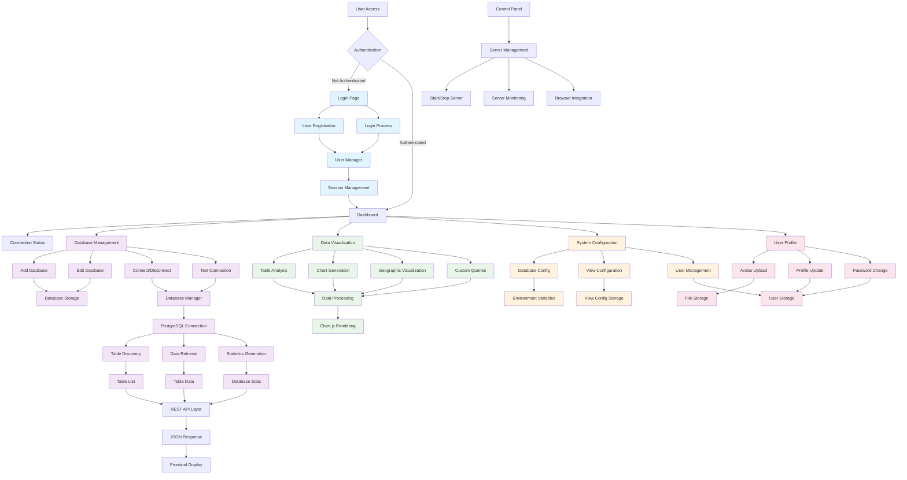

# Jarvis Database Dashboard Platform - Flow Diagram

## Platform Overview
This is a comprehensive Flask-based database management and visualization platform with user authentication, database management, and data visualization capabilities.

## System Architecture Flow

## Detailed Component Breakdown

### 1. Authentication System
- **Login/Registration**: User authentication with username/email and password
- **Session Management**: Persistent sessions with "Remember Me" functionality
- **Password Security**: PBKDF2 hashing with salt
- **User Storage**: JSON-based user storage system

### 2. Database Management
- **Multi-Database Support**: Connect to multiple PostgreSQL databases
- **Connection Management**: Test, connect, and disconnect from databases
- **Database Storage**: Persistent storage of database configurations
- **Real-time Status**: Live connection status monitoring

### 3. Data Visualization
- **Table Analysis**: Automatic table discovery and analysis
- **Chart Generation**: Multiple chart types (bar, line, pie, doughnut)
- **Geographic Visualization**: Map-based data visualization
- **Custom Queries**: User-defined SQL query execution
- **Export Functionality**: Data export in various formats

### 4. System Configuration
- **Database Configuration**: Environment-based database settings
- **View Configuration**: Customizable table view settings
- **User Management**: Admin functions for user creation and management
- **System Settings**: Application-wide configuration options

### 5. User Profile Management
- **Avatar Management**: Upload and manage user avatars
- **Profile Updates**: User information modification
- **Password Management**: Secure password change functionality
- **Session Control**: User session management

### 6. Control Panel
- **Server Management**: Start/stop Flask application
- **Process Monitoring**: Real-time server status and logs
- **Browser Integration**: Direct browser launching
- **System Monitoring**: Server performance tracking

## Key Features

### Core Functionality
- **Real-time Dashboard**: Live database status and statistics
- **Table Management**: Browse, analyze, and manage database tables
- **Data Visualization**: Interactive charts and graphs
- **Multi-user Support**: User authentication and role management
- **Responsive Design**: Mobile-friendly interface

### Technical Features
- **RESTful API**: Comprehensive API for all operations
- **Session Management**: Secure user session handling
- **File Upload**: Avatar and file management
- **Data Export**: Multiple export formats
- **Error Handling**: Comprehensive error management
- **Security**: Password hashing and session security

### User Experience
- **Modern UI**: Bootstrap-based responsive design
- **Interactive Elements**: Hover effects and animations
- **Real-time Updates**: Live data refresh capabilities
- **Quick Actions**: Fast access to common operations
- **Status Indicators**: Visual connection and system status

## Data Flow Summary

1. **User Authentication** → Session Creation → Dashboard Access
2. **Database Connection** → Table Discovery → Data Retrieval
3. **Data Processing** → Visualization Generation → User Display
4. **Configuration Changes** → Storage Update → System Refresh
5. **User Actions** → API Calls → Database Operations → Response

## File Structure
- `app.py` - Main Flask application
- `control_panel.py` - Server management interface
- `templates/` - HTML templates for all pages
- `static/` - CSS, JavaScript, and image assets
- `users.json` - User data storage
- `stored_databases.json` - Database configuration storage
- `view_configurations.json` - View configuration storage

This platform provides a comprehensive solution for database management, visualization, and user administration with a modern, responsive interface.
